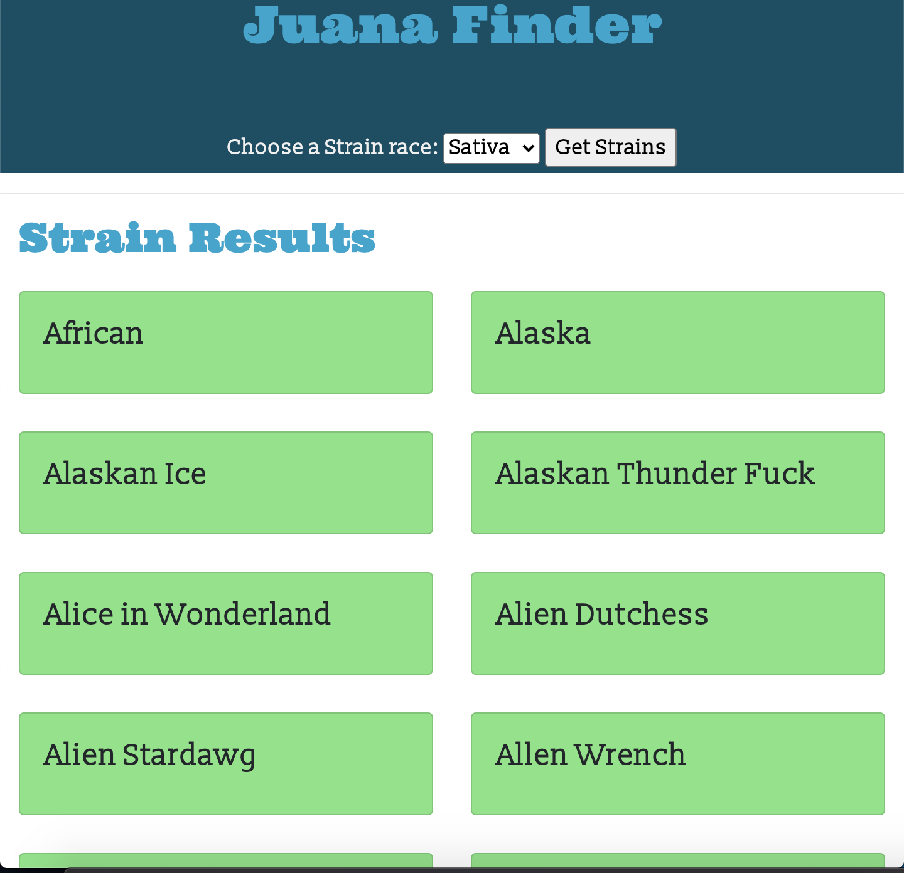

# Juana Finder

- Live Site https://duanleewatkins.github.io/juana-Finder/
  

If you are a newbie to the Marijuana world or a Marijauna connoisseur, [Juana Finder] (https://duanleewatkins.github.io/juana-Finder/) is the app for you. Juana Finder allows users to search for any strain of marijuana based on the three race types: Indica, Sativa, and Hybrid. Each strain also has a short discription of the strain detailing the user of it's origin, flavor, and effects.

This app:
-Utilizes a custom mobile first designs.
-Uses JQuery, JavaScript, HTML, Bootstrap, and CSS.
-Access data from http://strains.evanbusse.com/
